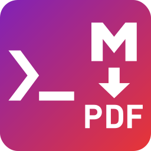

<h1 align="center">Markdown2Pdf.Console</h1>

<p align="center">
  
  <br>
</p>

Command-line application for converting Markdown to Pdf, using [Markdown2Pdf](https://github.com/Flayms/Markdown2Pdf).

<!--TOC-->

## Getting started

Convert a Markdown-File:
```sh
Markdown2Pdf.Console "README.md" # Outputs README.pdf
```

Open Help:
```sh
Markdown2Pdf.Console --help # Display all options
```

## Options

```
  -h, --header-path              Path to an html-file to use as the
                                 document-header.

  -f, --footer-path              Path to an html-file to use as the
                                 document-footer.

  -o, --open-after-conversion    (Default: false) If enabled, opens the
                                 generated pdf after execution.

  -m, --margin-options           (Default: 50px) Css-Margins for the content in
                                 the pdf to generate. Values must be
                                 comma-separated.

  -c, --chrome-path              Path to chrome or chromium executable or
                                 self-downloads it if null.

  -k, --keep-html                If this is set, the temporary html file does
                                 not get deleted.

  -t                             (Default: github) The theme to use for styling
                                 the document. Can either be a predefined value
                                 (github, latex) or a path to a custom css.

  --code-highlight-theme         (Default: github) The theme to use for styling
                                 the markdown code-blocks. Valid Values: See
                                 https://github.com/Flayms/Markdown2Pdf/blob/mai
                                 n/Markdown2Pdf/Options/CodeHighlightTheme.cs
                                 for an overview of all themes.

  --document-title               The title of this document. Can be injected
                                 into the header / footer by adding the class
                                 document-title to the element.

  --custom-css                   A string containing CSS to apply extra styling
                                 to the document.

  -l, --is-landscape             (Default: false) Paper orientation.

  -p, --format                   (Default: A4) The paper format for the PDF.
                                 Valid values: Letter, Legal, Tabloid, Ledger,
                                 A0-A6

  -s, --scale                    (Default: 1) Scale of the content. Must be
                                 between 0.1 and 2.

  --toc                          If set, Creates a TOC out of the markdown
                                 headers and writes it into a <!--TOC--> comment
                                 within the markdown document. Valid values:
                                 Ordered, Unordered

  --toc-max-depth                (Default: 3) The maximum depth of the table of
                                 contents. Requires --toc to be set.

  --help                         Display this help screen.

  --version                      Display version information.

  value pos. 0                   The path to the markdown file to parse.

  value pos. 1                   Path where the PDF file should be generated. If
                                 not set, defaults to <markdown-filename>.pdf.
```